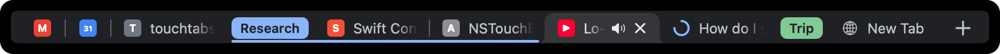

# TouchTabs

**Your Chrome tab strip, on the MacBook Pro Touch Bar.**



TouchTabs mirrors the tabs of your focused Chrome window onto the Touch Bar,
drawn like Chrome's own dark tab strip: favicons, fading titles, the active tab's
shape and close button, pinned tabs, tab groups with colored chips and
underlines, audio indicators and loading spinners.

- **Tap** a tab to switch to it
- **Tap ✕** on the active tab to close it
- **Tap +** for a new tab
- **Tap a group chip** to collapse or expand the group
- **Swipe** to scroll when there are more tabs than fit

It works like part of the browser. Chrome starts TouchTabs when it launches and
stops it when it quits. While Chrome is in front, your tabs take up the whole
Touch Bar; switch apps and they get out of the way. There's no menu bar icon
and no login item.

Here it is on real hardware:


## How it works

```
┌──────────────────────┐  native messaging (stdin/stdout) ┌──────────────────────┐
│  Chrome extension    │ ──── tabs, groups, favicons ───▶ │  TouchTabs helper    │
│  (MV3 service worker)│ ◀─── activate / close / new ──── │  (Swift, no UI)      │
└──────────────────────┘                                  └──────────┬───────────┘
          Chrome starts the helper when the extension connects       │ system-modal
          and stops it when the browser quits                        ▼ NSTouchBar
                                                               ┌────────────┐
                                                               │ Touch Bar  │
                                                               └────────────┘
```

- **`extension/`**: a Manifest V3 extension. It listens to `chrome.tabs`,
  `chrome.tabGroups` and `chrome.windows` events and streams the focused window's
  tab strip to the helper over
  [native messaging](https://developer.chrome.com/docs/extensions/develop/concepts/native-messaging).
  It fetches favicons through Chrome's own favicon cache (the `favicon`
  permission), so it never contacts any website.
- **`app/`**: a small Swift helper with no dependencies that custom-draws the
  tab strip. Extensions can't draw on the Touch Bar, and normally only the
  frontmost app can, so the helper uses the private system-modal Touch Bar API
  (the one [Pock](https://github.com/pock/pock) and
  [MTMR](https://github.com/Toxblh/MTMR) use) to show the strip on top of
  Chrome's own bar.

The message format is documented in [PROTOCOL.md](PROTOCOL.md).

## Install

Requirements: a Mac with a Touch Bar, macOS 11 or later, and Chrome 116+ (or
another Chromium browser: Edge, Brave, Opera, Vivaldi, Arc).

### 1. Install the helper

**Download:** get `TouchTabs.zip` from the
[latest release](https://github.com/miqqidami/touchtabs/releases/latest), unzip
it, move `TouchTabs.app` to Applications and open it once. It's ad-hoc signed,
so macOS may block it the first time: open **System Settings → Privacy &
Security** and click **Open Anyway**. A dialog confirms it's registered with
your browsers.

**Or build it:**

```sh
git clone https://github.com/miqqidami/touchtabs.git
cd touchtabs
make install        # builds TouchTabs.app into /Applications and registers it with your browsers
```

This needs the Xcode command line tools (Swift 5.9+).

Either way, TouchTabs registers itself as a native messaging host with every
Chromium browser it finds. Keep the app where you installed it, because the
browser starts it from there.

### 2. Add the extension

Install TouchTabs from the Chrome Web Store (link coming once it's approved),
or load it unpacked:

1. Open `chrome://extensions` and turn on **Developer mode**.
2. Click **Load unpacked** and select the `extension/` folder.

Switch to Chrome. Your tabs appear on the Touch Bar, and the toolbar button's
tooltip shows whether it's connected.

## Settings

- **Toolbar button / ⌥⇧T**: click the TouchTabs button in Chrome's toolbar (or
  press Option-Shift-T) to show or hide your tabs on the Touch Bar. While
  they're hidden, Chrome's own Touch Bar is back and the button shows an
  **off** badge. Change the shortcut at `chrome://extensions/shortcuts`.
- **Options** (right-click the toolbar button → Options): connection status,
  the same on/off switch, and:
  - **Keep Control Strip visible**: by default TouchTabs uses the whole Touch
    Bar while the browser is in front, which hides brightness and volume. Turn
    this on to keep them next to your tabs. macOS then adds a ✕ on the left.
  - **Show over all apps**: keep your tabs on the Touch Bar even when the
    browser isn't in front.

If the button shows a red **!**, the helper isn't installed. Click the button
for setup help.

With several browsers or profiles running, each starts its own helper. The
helpers coordinate so that the most recently focused window is the one you see.

Advanced settings (`defaults write io.github.miqqidami.touchtabs <key> …`, then
run `TouchTabs --install` again):

| Key | Type | Purpose |
| --- | --- | --- |
| `AllowedExtensionIDs` | array | Extra extension IDs allowed to start the helper (for example, a Web Store build) |
| `ExtraBrowserBundleIDs` | array | More app bundle IDs to treat as browsers |

## Privacy and security

See [PRIVACY.md](PRIVACY.md) for the full policy.


- Tab titles and URLs go only from your browser to the helper, over the pipes
  Chrome sets up between them. Nothing leaves your Mac, and neither part makes
  a network request of its own.
- The helper's native messaging manifest allows only the TouchTabs extension to
  start it. That extension's ID is pinned by the `key` in
  `extension/manifest.json`.
- The extension asks for `tabs` (titles/URLs), `tabGroups`, `favicon`,
  `nativeMessaging`, `storage` (the settings) and `alarms` (to reconnect
  if the helper is installed after the browser starts). It needs no host
  permissions.

## Uninstall

```sh
/Applications/TouchTabs.app/Contents/MacOS/TouchTabs --uninstall
rm -rf /Applications/TouchTabs.app
```

Then remove the extension from `chrome://extensions`.

## Development

```sh
make demo       # show sample tabs on the Touch Bar, no browser needed
make preview    # re-render docs/preview.png offscreen
make icons      # re-render the extension icons from the vector artwork
make app && scripts/e2e-test.py   # headless Chrome + real helper + Touch Bar screenshots
make extension-zip
make release    # build/TouchTabs.zip for a GitHub Release
make store      # Chrome Web Store upload + listing images; see docs/store/LISTING.md
```

The original version, a menu bar app that talked to the extension over a
localhost WebSocket, is kept on the
[`menubar-app`](https://github.com/miqqidami/touchtabs/tree/menubar-app)
branch (tag `v1.0.0`).

Code map:

| File | What it does |
| --- | --- |
| `app/Sources/TouchTabs/TabStripView.swift` | Chrome-style layout, drawing, taps, scrolling with momentum |
| `app/Sources/TouchTabs/SystemTouchBar.swift` | Private DFRFoundation / NSTouchBar calls, looked up at runtime |
| `app/Sources/TouchTabs/NativeMessagingChannel.swift` | Length-prefixed JSON over stdin/stdout |
| `app/Sources/TouchTabs/HostInstaller.swift` | Registers the helper with each browser |
| `app/Sources/TouchTabs/AppDelegate.swift` | When to show the strip, coordination between helpers |
| `extension/background.js` | Tab/group/window events, favicons, commands |

## Limitations

- Relies on private macOS APIs, so a future macOS update could break it. This
  version was tested on macOS 26 (Tahoe) on a 16" MacBook Pro.
- Only the focused window's tabs are shown, just like Chrome's tab strip.
- Incognito windows are shown only if you allow the extension in incognito.

## License

[MIT](LICENSE)
